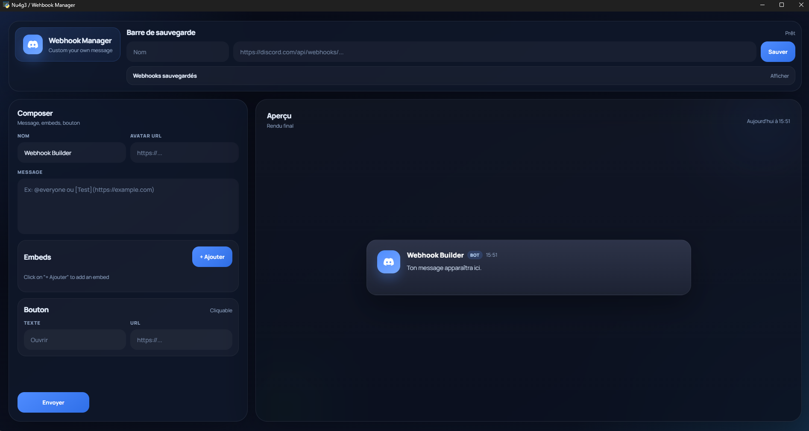

# 🚀 Nu4g3 / Webhook Manager

Une application de bureau ultra-moderne et performante pour gérer et envoyer vos Webhooks Discord avec une précision chirurgicale. Conçue pour offrir une expérience utilisateur premium avec une interface fluide et des effets visuels avancés.


---

## 🇫🇷 Version Française

### ✨ Fonctionnalités Détaillées

#### 🎨 Interface & UX (User Experience)
*   **Aperçu Temps Réel Dynamique** : Chaque modification dans l'éditeur est instantanément reflétée dans la fenêtre de prévisualisation, simulant parfaitement le rendu Discord.
*   **Immersion 3D Interactive** : La carte de prévisualisation utilise une transformation CSS 3D qui réagit aux mouvements de votre souris pour un effet de profondeur saisissant.
*   **Design Premium** : Utilisation intensive du *Glassmorphism* (effets de flou d'arrière-plan), de dégradés subtils et d'animations de transition fluides.
*   **Mode Sombre Natif** : Une palette de couleurs optimisée pour réduire la fatigue oculaire tout en restant fidèle à l'esthétique Discord.

#### 📝 Éditeur de Message Puissant
*   **Configuration du Webhook** : Personnalisez le nom du "Bot" et l'URL de son avatar pour chaque envoi.
*   **Système d'Embeds Multiples** :
    *   **Titre & URL** : Titres cliquables supportant les hyperliens.
    *   **Auteur** : Ajoutez une ligne d'auteur en haut de l'embed.
    *   **Description** : Support complet du Markdown Discord de base (liens, mentions).
    *   **Couleurs** : Sélecteur de couleur hexadécimal pour la barre latérale de l'embed.
    *   **Médias** : Support des images via URL.
    *   **Footer & Timestamp** : Pied de page personnalisable avec horodatage automatique ou manuel.
*   **Composants (Boutons)** : Ajoutez des boutons de type "Lien" sous vos messages pour rediriger vos utilisateurs.

#### 📚 Gestion de Bibliothèque
*   **Sauvegarde en un clic** : Enregistrez vos configurations (Nom + URL) dans la "Barre de sauvegarde".
*   **Stockage Persistant** : Vos webhooks sont stockés localement dans le dossier `Webhook_Library/` au format `.cfg`.
*   **Gestion Rapide** : Chargez instantanément un profil sauvegardé ou supprimez les anciens directement depuis l'interface.

---

### 🚀 Installation & Utilisation

#### Prérequis
*   Python 3.8+
*   Dépendances : `pip install requests pywebview`

#### Lancement
```bash
python wehbook_manager.py
```

#### Guide Rapide
1.  **Enregistrement** : Saisissez l'URL de votre webhook et un nom dans la barre du haut, puis cliquez sur "Sauver".
2.  **Composition** : Remplissez les champs (Nom, Avatar, Message). Utilisez le bouton "+ Ajouter" pour créer des embeds.
3.  **Envoi** : Cliquez sur "Envoyer" pour propager le message sur votre serveur Discord.

---

### 🛡️ Débogage & Intégrité
*   **`Debug/all_files_list.txt`** : Liste de référence exhaustive de tous les composants et assets nécessaires au projet.
*   **`Debug/debug.py`** : Script de vérification d'intégrité. Il scanne le répertoire pour s'assurer qu'aucun fichier n'est manquant et redirige vers le dépôt GitHub en cas de corruption.

---

### 🛠️ Technologies
*   **Backend** : Python 3, `requests` (API), `configparser` (Stockage), `pywebview` (Fenêtrage).
*   **Frontend** : HTML5, CSS3 Moderne (Custom Scrollbars, Backdrop-filters), JS Vanilla.

---

<br>

---

## 🇺🇸 English Version (US)

### ✨ Detailed Features

#### 🎨 Interface & UX
*   **Dynamic Real-Time Preview**: Any change in the editor is instantly reflected in the preview window, perfectly simulating Discord's rendering.
*   **Interactive 3D Immersion**: The preview card uses a 3D CSS transformation that reacts to mouse movements for a striking depth effect.
*   **Premium Design**: Heavy use of *Glassmorphism* (background blur effects), subtle gradients, and smooth transition animations.
*   **Native Dark Mode**: A color palette optimized to reduce eye strain while staying true to the Discord aesthetic.

#### 📝 Powerful Message Editor
*   **Webhook Configuration**: Customize the "Bot" name and avatar URL for each send.
*   **Multiple Embeds System**:
    *   **Title & URL**: Clickable titles supporting hyperlinks.
    *   **Author**: Add an author line at the top of the embed.
    *   **Description**: Full support for basic Discord Markdown (links, mentions).
    *   **Colors**: Hex color picker for the embed sidebar.
    *   **Media**: Support for images via URL.
    *   **Footer & Timestamp**: Customizable footer with automatic or manual timestamps.
*   **Components (Buttons)**: Add "Link" style buttons under your messages to redirect users.

#### 📚 Library Management
*   **One-Click Save**: Save your configurations (Name + URL) in the "Save Bar".
*   **Persistent Storage**: Your webhooks are stored locally in the `Webhook_Library/` folder in `.cfg` format.
*   **Quick Management**: Instantly load a saved profile or delete old ones directly from the interface.

---

### 🚀 Setup & Usage

#### Prerequisites
*   Python 3.8+
*   Dependencies: `pip install requests pywebview`

#### Launch
```bash
python wehbook_manager.py
```

#### Quick Guide
1.  **Registration**: Enter your webhook URL and a name in the top bar, then click "Save".
2.  **Composition**: Fill in the fields (Name, Avatar, Message). Use the "+ Add" button to create embeds.
3.  **Send**: Click "Send" to push the message to your Discord server.

---

### 🛡️ Debugging & Integrity
*   **`Debug/all_files_list.txt`**: Exhaustive reference list of all components and assets required for the project.
*   **`Debug/debug.py`**: Integrity verification script. It scans the directory to ensure no files are missing and redirects to the GitHub repository if corruption is detected.

---

### 🛠️ Technologies
*   **Backend**: Python 3, `requests` (API), `configparser` (Storage), `pywebview` (GUI).
*   **Frontend**: HTML5, Modern CSS3 (Custom Scrollbars, Backdrop-filters), Vanilla JS.

---

<p align="center">
  
</p>

<br>

<p align="center">
  Developed with ❤️ by <b>Nu4g3</b>
</p>
